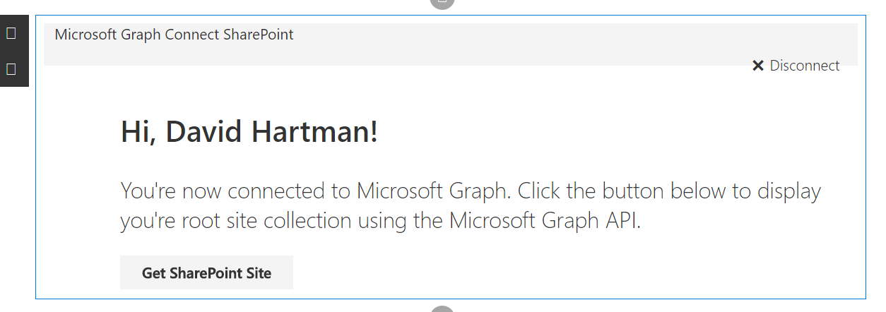
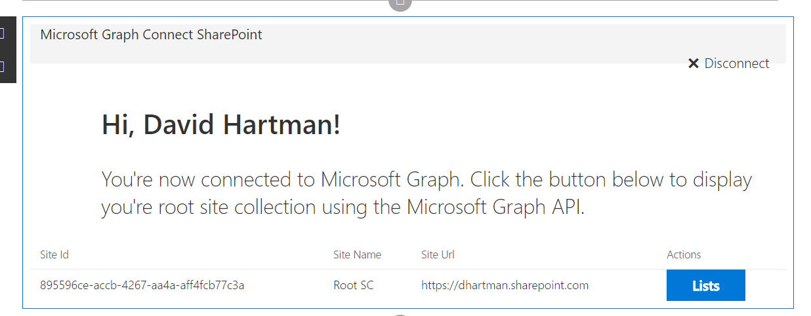
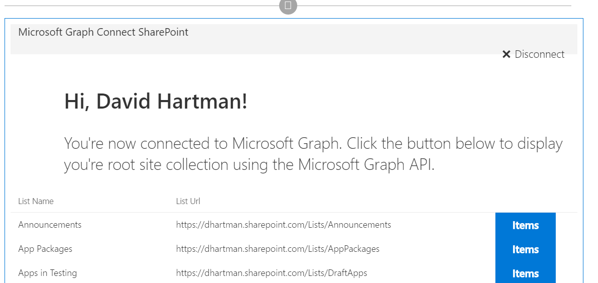
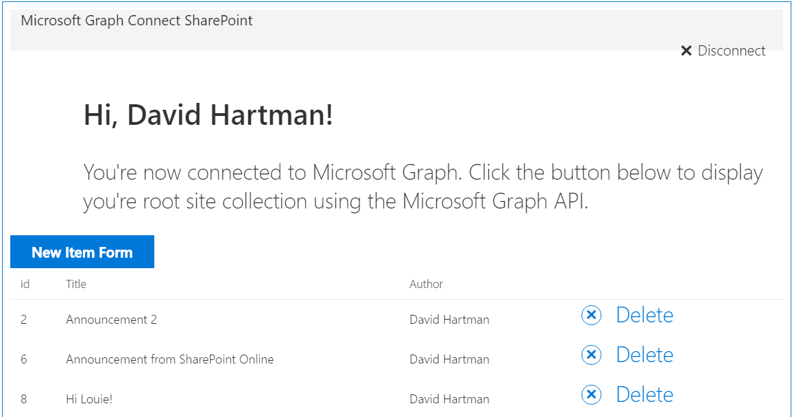

# Angular MS Graph Web Part Built with Angular v1.x

## Summary

This is a sample MS Graph web part that connects to Microsoft Graph and pulls SharePoint information from your
tenant. It will first pull the root site collection (currently a limitation by Microsoft Graph), then it will
display all the lists associated with the site followed by all the items inside the list.

> Note: I currently only have models developed for the Announcements list. All other lists will currently generate errors.

## Compatibility

| :warning: Important          |
|:---------------------------|
| Every SPFx version is only compatible with specific version(s) of Node.js. In order to be able to build this sample, please ensure that the version of Node on your workstation matches one of the versions listed in this section. This sample will not work on a different version of Node.|
|Refer to <https://aka.ms/spfx-matrix> for more information on SPFx compatibility.   |

 

-Compatible-green.svg)

## Applies to

* [SharePoint Framework Developer Preview](https://learn.microsoft.com/sharepoint/dev/spfx/sharepoint-framework-overview)
* [Office 365 developer tenant](https://learn.microsoft.com/sharepoint/dev/spfx/set-up-your-developer-tenant)

## Solution

Solution|Author(s)
--------|---------
angular-msgraph|[David Hartman](https://github.com/davidhartman) ([Slalom](https://slalom.com))

## Version history

Version|Date|Comments
-------|----|--------
2.0|April 19th, 2017|GA Release
1.0|February 6th, 2017|Initial release

## Configuration Bliss
- clone this repo
- in the command line run:
 - `npm i typings -g`
 - `npm i`
 - `gulp serve

## Register the application

1. Sign into the [App Registration Portal](https://apps.dev.microsoft.com/) using either your personal or work or school account.

2. Choose **Add an app**.

3. Enter a name for the app, and choose **Create application**.

   The registration page displays, listing the properties of your app.

4. Copy the Application Id. This is the unique identifier for your app.

5. Under **Platforms**, choose **Add Platform**.

6. Choose **Web**.

7. Make sure the **Allow Implicit Flow** check box is selected, and enter *http://{Location of SP Workbench}* as the Redirect URI.

8. Choose **Save**.

## Configuring the App

1. Replace the **aad** and **redirect_uri** placeholder values with the application ID and redirect url of your registered Azure application in the GraphHelper.ts file Under
src -> angularMsGraph -> GraphHelper.ts

## Help

We do not support samples, but this community is always willing to help, and we want to improve these samples. We use GitHub to track issues, which makes it easy for  community members to volunteer their time and help resolve issues.

If you're having issues building the solution, please run [spfx doctor](https://pnp.github.io/cli-microsoft365/cmd/spfx/spfx-doctor/) from within the solution folder to diagnose incompatibility issues with your environment.

You can try looking at [issues related to this sample](https://github.com/pnp/sp-dev-fx-webparts/issues?q=label%3A"sample%3A%20angular-msgraph" ) to see if anybody else is having the same issues.

You can also try looking at [discussions related to this sample](https://github.com/pnp/sp-dev-fx-webparts/discussions?discussions_q=angular-msgraph) and see what the community is saying.

If you encounter any issues while using this sample, [create a new issue](https://github.com/pnp/sp-dev-fx-webparts/issues/new?assignees=&labels=Needs%3A+Triage+%3Amag%3A%2Ctype%3Abug-suspected%2Csample%3A%20angular-msgraph&template=bug-report.yml&sample=angular-msgraph&authors=@davidhartman&title=angular-msgraph%20-%20).

For questions regarding this sample, [create a new question](https://github.com/pnp/sp-dev-fx-webparts/issues/new?assignees=&labels=Needs%3A+Triage+%3Amag%3A%2Ctype%3Aquestion%2Csample%3A%20angular-msgraph&template=question.yml&sample=angular-msgraph&authors=@davidhartman&title=angular-msgraph%20-%20).

Finally, if you have an idea for improvement, [make a suggestion](https://github.com/pnp/sp-dev-fx-webparts/issues/new?assignees=&labels=Needs%3A+Triage+%3Amag%3A%2Ctype%3Aenhancement%2Csample%3A%20angular-msgraph&template=question.yml&sample=angular-msgraph&authors=@davidhartman&title=angular-msgraph%20-%20).

## Disclaimer

**THIS CODE IS PROVIDED *AS IS* WITHOUT WARRANTY OF ANY KIND, EITHER EXPRESS OR IMPLIED, INCLUDING ANY IMPLIED WARRANTIES OF FITNESS FOR A PARTICULAR PURPOSE, MERCHANTABILITY, OR NON-INFRINGEMENT.**

 
