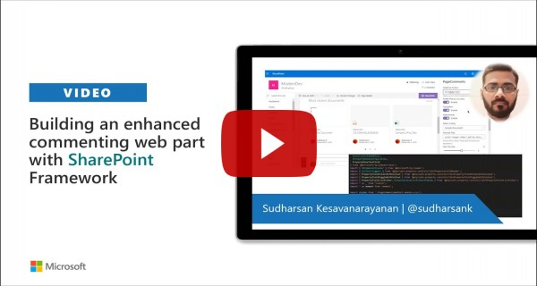

# Advanced Comments Box

## Summary
>
> This component is developed for the advanced usage of commenting the page or article etc. **_Page Comments_** lists will be created to store the comments. Following are some of the features of this component.

* Can be used in the modern page with the existing comments disabled.
* Classification of comments by **_Popular_**, **_Newest_**, **_Oldest_** and **_Attachments_**
* Ability to refer files as a comment.
* **_Edit_**, **_Reply_** (nested comments), **_Like_** & **_Delete_** options are available based on the configuration.
* **_Hashtag_** & **_Ping Users_** are also available.
* **_Document Preview_** is also available for all office documents and videos based on the configuration.
* Display of **_New_** icon for the current day comments.

## Properties

1. **_DateTime_** format on when the comments were added or modified

2. **_Profile Picture_** style, whether it has to be rounded or square

3. Enable or Disable **_Navigation_** whether to display the comments classification

4. Enable or disable **_Attachments_**. Following properties are required when attachments are enabled.

    * **_Library_** to store the files uploaded.
    * Allowed **_File Formats_** in the comments box.
    * Maximum **_File Size_** allowed.

5. **_Ping Users_** will allow to mention the users. The users are pulled from the **Site Users**.

6. **_Edit_** comments can be enabled or disabled to allow the users to edit the comments. Files added can be deleted not edited.
    * **_Delete_** option can be enabled or disabled to allow the users to delete the comments. Comments with no-replies are allowed to delete. Delete is allowed only if Edit is allowed.

7. **_Upvoting_** of comments to like or dislike the comments.

8. **_Hashtags_**

9. **_Document Preview_** can be enabled or disabled for the office files and videos.

## Compatibility

| :warning: Important          |
|:---------------------------|
| Every SPFx version is only compatible with specific version(s) of Node.js. In order to be able to build this sample, please ensure that the version of Node on your workstation matches one of the versions listed in this section. This sample will not work on a different version of Node.|
|Refer to <https://aka.ms/spfx-matrix> for more information on SPFx compatibility.   |

This sample is optimally compatible with the following environment configuration:

-Incompatible-red.svg "SharePoint Server 2016 Feature Pack 2 requires SPFx 1.1")

For more information about SPFx compatibility, please refer to <https://aka.ms/spfx-matrix>

## Applies to

* [SharePoint Framework](https://learn.microsoft.com/sharepoint/dev/spfx/sharepoint-framework-overview)
* [Microsoft 365 tenant](https://learn.microsoft.com/sharepoint/dev/spfx/set-up-your-development-environment)

> Get your own free development tenant by subscribing to [Microsoft 365 developer program](http://aka.ms/m365devprogram)

## Prerequisites

None

## Contributors

* [Sudharsan K.](https://github.com/sudharsank) ([@sudharsank](https://twitter.com/sudharsank), [Know More](http://windowssharepointserver.blogspot.com/))
* [Aimery Thomas](https://github.com/a1mery)

## Version history

Version|Date|Comments
-------|----|--------
1.0.0.0|Feb 05 2020|Initial release
1.1.0.0|Oct 06, 2022|Upgraded to 1.15.2
1.2.0.0|March 09, 2023|Upgraded to 1.16.1

## Minimal Path to Awesome

* Clone this repository
* From your command line, change your current directory to the directory containing this sample (`js-advanced-commenting`, located under `samples`)
* in the command line run:
  * `npm install`
  * `gulp bundle --ship && gulp package-solution --ship`
* Add the `.sppkg` file to the app catalog and add the **Page Comments** web part to the page.

> This sample can also be opened with [VS Code Remote Development](https://code.visualstudio.com/docs/remote/remote-overview). Visit <https://aka.ms/spfx-devcontainer> for further instructions.

## Features

* Used [SharePoint Framework Property Controls](https://sharepoint.github.io/sp-dev-fx-property-controls/) to create the property pane controls(Text, ListPicker, Toggle) with callout.
* Used [PnP](https://pnp.github.io/pnpjs/) for communication with SharePoint.
* Used [jquery-comments](https://viima.github.io/jquery-comments/) for comments control with some customization.
* Used [Moment.js](https://momentjs.com/) for datetime formatting.

## Video

## Help

We do not support samples, but we this community is always willing to help, and we want to improve these samples. We use GitHub to track issues, which makes it easy for  community members to volunteer their time and help resolve issues.

If you're having issues building the solution, please run [spfx doctor](https://pnp.github.io/cli-microsoft365/cmd/spfx/spfx-doctor/) from within the solution folder to diagnose incompatibility issues with your environment.

You can try looking at [issues related to this sample](https://github.com/pnp/sp-dev-fx-webparts/issues?q=label%3A%22sample%3A%20js-advanced-commenting") to see if anybody else is having the same issues.

You can also try looking at [discussions related to this sample](https://github.com/pnp/sp-dev-fx-webparts/discussions?discussions_q=js-advanced-commenting) and see what the community is saying.

If you encounter any issues while using this sample, [create a new issue](https://github.com/pnp/sp-dev-fx-webparts/issues/new?assignees=&labels=Needs%3A+Triage+%3Amag%3A%2Ctype%3Abug-suspected%2Csample%3A%20js-advanced-commenting&template=bug-report.yml&sample=js-advanced-commenting&authors=@sudharsank&title=js-advanced-commenting%20-%20).

For questions regarding this sample, [create a new question](https://github.com/pnp/sp-dev-fx-webparts/issues/new?assignees=&labels=Needs%3A+Triage+%3Amag%3A%2Ctype%3Aquestion%2Csample%3A%20js-advanced-commenting&template=question.yml&sample=js-advanced-commenting&authors=@sudharsank&title=js-advanced-commenting%20-%20).

Finally, if you have an idea for improvement, [make a suggestion](https://github.com/pnp/sp-dev-fx-webparts/issues/new?assignees=&labels=Needs%3A+Triage+%3Amag%3A%2Ctype%3Aenhancement%2Csample%3A%20js-advanced-commenting&template=question.yml&sample=js-advanced-commenting&authors=@sudharsank&title=js-advanced-commenting%20-%20).

## Disclaimer

**THIS CODE IS PROVIDED _AS IS_ WITHOUT WARRANTY OF ANY KIND, EITHER EXPRESS OR IMPLIED, INCLUDING ANY IMPLIED WARRANTIES OF FITNESS FOR A PARTICULAR PURPOSE, MERCHANTABILITY, OR NON-INFRINGEMENT.**

