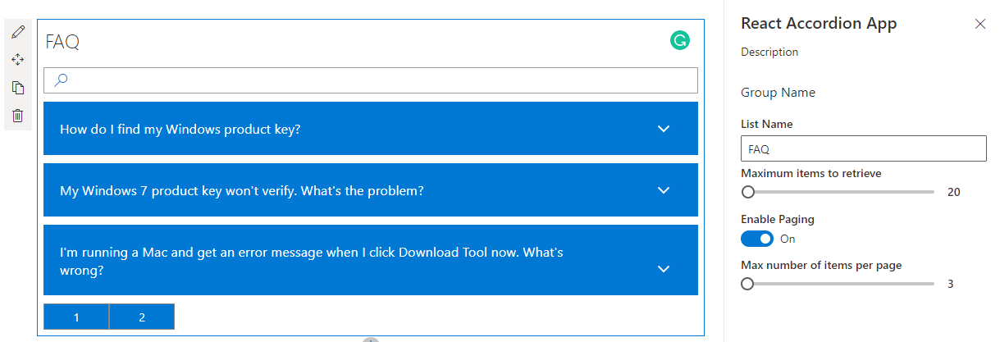

# Using React Accordion plugin with SPFx

## Summary

This is a sample web Part that illustrates the use of React Accessible Accordion plugin for building SharePoint Framework client-side web parts to show SharePoint list data in Accordion format.

## Compatibility

 
 

-Incompatible-red.svg "SharePoint Server 2016 Feature Pack 2 requires SPFx 1.1")

## Applies to

* [SharePoint Framework Developer Preview](https://docs.microsoft.com/sharepoint/dev/spfx/sharepoint-framework-overview)
* [Office 365 developer tenant](https://docs.microsoft.com/sharepoint/dev/spfx/set-up-your-developer-tenant)

## Solution

Solution|Author(s)
--------|---------
react-accordion | Gautam Sheth (SharePoint Consultant, RapidCircle)
react-accordion | Abhishek Garg

## Version history

Version|Date|Comments
-------|----|--------
1.0|August 17, 2018|Initial release
2.0|January 19, 2020|Upgrade to SPFx 1.10
2.1|June 22, 2020|Added pagination (Abhishek Garg)
2.2|October 1, 2020 | Added new Pagination Configuration (@beau__cameron)
2.3|September 30, 2021 | Added sorting (@fthorild)

## Minimal Path to Awesome

### Build and Test

1. Clone this repo
2. In the command line run
    - `npm i`
    - `gulp build`
    - `gulp serve --nobrowser`
3. Create a custom list (e.g. FAQ) with Title and Description(internal name) of type Enhanced rich text on your SharePoint site. 
4. Populate the list with some items
5. Navigate to the hosted version of SharePoint workbench, eg. **https://\<tenant>.sharepoint.com/sites/\<your site>/_layouts/15/workbench.aspx**
6. Add the Web Part to the canvas and configure it.

### Package and deploy

1. In the command line run
    - `gulp bundle --ship`
    - `gulp package-solution --ship`
2. Install into your SharePoint app catalog and add it to a SharePoint site.
3. Navigate to your site, eg. **https://\<tenant>.sharepoint.com/sites/\<your site>**
4. Create a custom list with Title and Description(internal name) of type Enhanced rich text. 
5. Populate the list with some items
6. Navigate to a page on your site where the custom list is created
7. Add the Web Part to the page and configure it.

## Features

This project contains sample client-side web part built on the SharePoint Framework illustrating how to show list data in Accordion format using React framework.

This sample illustrates the following concepts on top of the SharePoint Framework:

### General

- performing SharePoint GET operation in React using inbuilt SP Http Client
- Using Fabric UI button component for pagination
- optimizing REST responses for performance using `nometadata` option of JSON light
- using PnP web part title control of @pnp/spfx-controls-react library
- showing SharePoint list data in Accordion format using React Accessible Accordion plugin
- searching in the fetched data by making use of Search Box from Office Fabric UI

## Help

We do not support samples, but we this community is always willing to help, and we want to improve these samples. We use GitHub to track issues, which makes it easy for  community members to volunteer their time and help resolve issues.

If you're having issues building the solution, please run [spfx doctor](https://pnp.github.io/cli-microsoft365/cmd/spfx/spfx-doctor/) from within the solution folder to diagnose incompatibility issues with your environment.

If you encounter any issues while using this sample, [create a new issue](https://github.com/pnp/sp-dev-fx-webparts/issues/new?assignees=&labels=Needs%3A+Triage+%3Amag%3A%2Ctype%3Abug-suspected%2Csample%3A%20REACT-ACCORDION&authors=@AbhishekGarg%20@gautamdsheth&template=bug-report.yml&sample=REACT-ACCORDION&authors=@AbhishekGarg%20@gautamdsheth&title=REACT-ACCORDION%20-%20).

For questions regarding this sample, [create a new question](https://github.com/pnp/sp-dev-fx-webparts/issues/new?assignees=&labels=Needs%3A+Triage+%3Amag%3A%2Ctype%3Aquestion%2Csample%3A%20REACT-ACCORDION&authors=@AbhishekGarg%20@gautamdsheth&template=question.yml&sample=REACT-ACCORDION&authors=@AbhishekGarg%20@gautamdsheth&title=REACT-ACCORDION%20-%20).

Finally, if you have an idea for improvement, [make a suggestion](https://github.com/pnp/sp-dev-fx-webparts/issues/new?assignees=&labels=Needs%3A+Triage+%3Amag%3A%2Ctype%3Aenhancement%2Csample%3A%20REACT-ACCORDION&authors=@AbhishekGarg%20@gautamdsheth&template=question.yml&sample=REACT-ACCORDION&authors=@AbhishekGarg%20@gautamdsheth&title=REACT-ACCORDION%20-%20).

## Disclaimer

**THIS CODE IS PROVIDED *AS IS* WITHOUT WARRANTY OF ANY KIND, EITHER EXPRESS OR IMPLIED, INCLUDING ANY IMPLIED WARRANTIES OF FITNESS FOR A PARTICULAR PURPOSE, MERCHANTABILITY, OR NON-INFRINGEMENT.**

