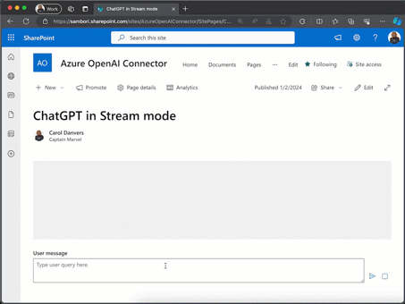

# Calling Azure OpenAI API in Stream mode

## Summary

This web part shows how you can call Azure OpenAI API in Streaming mode, so the web part shows the data coming from the API in chunks, giving a much better user experience, so you are not waiting for the entire response. It also shows how you can cancel the streaming response at any point, which is useful to safe some tokens (hence money), if the generating response does not look good to you (like when getting AI hallucinations).

## Compatibility

| :warning: Important          |
|:---------------------------|
| Every SPFx version is optimally compatible with specific versions of Node.js. In order to be able to build this sample, you need to ensure that the version of Node on your workstation matches one of the versions listed in this section. This sample will not work on a different version of Node.|
|Refer to <https://aka.ms/spfx-matrix> for more information on SPFx compatibility.   |

This sample is optimally compatible with the following environment configuration:

-Incompatible-red.svg "SharePoint Server 2016 Feature Pack 2 requires SPFx 1.1")

## Applies to

- [SharePoint Framework](https://aka.ms/spfx)
- [Microsoft 365 tenant](https://docs.microsoft.com/en-us/sharepoint/dev/spfx/set-up-your-developer-tenant)

> Get your own free development tenant by subscribing to [Microsoft 365 developer program](http://aka.ms/o365devprogram)

## Prerequisites

- Your Azure Subscription has the Azure OpenAI service available. You will see this message if you try to add Azure OpenAI service in your Subscription (follow the link in the Azure portal to request access).

> Azure OpenAI Service is currently available to customers via an application form. The selected subscription has not been enabled for use of the service and does not have quota for any pricing tiers. Click here to request access to Azure OpenAI service.

- You have created an Azure OpenAI service in your subscription
- Create a Deployment Model (use GPT-3.5-turbo or GPT-4)
- Grab the Azure OpenAI Key, Endpoint and the deployment model created in previous step (go to your _Azure OpenAI service -> Keys and Endpoint_)

## Contributors

- [Luis Mañez](https://github.com/luismanez)
- [Chris Kent](https://twitter.com/thechriskent)

## Version history

| Version | Date             | Comments        |
| ------- | ---------------- | --------------- |
| 1.0     | January 2, 2024 | Initial release |
| 1.1     | January 29, 2024 | Things and Stuff |

## Minimal Path to Awesome

- [Install the MS Graph Toolkit for SPFx package](https://learn.microsoft.com/graph/toolkit/get-started/mgt-spfx).
- Clone this repository
- Ensure that you are at the solution folder
- in the command-line run:
  - `npm install`
  - `gulp serve`
- Add the web part in the SharePoint workbench or any SharePoint page (appending _?debug=true&noredir=true&debugManifestsFile=<https://localhost:4321/temp/manifests.js>_ to the page URL)
- Edit the web part with your Azure OpenAI API values (see _prerequisites_ section)

## Features

This sample illustrates the following concepts:

- Calling Azure OpenAI _chat/completions_ endpoint in streaming mode
- Keeping chat history during the chat session
- How to cancel an streaming request
- Using MS Graph toolkit with the Person component
- Multiple FluentUI components

> Notice that better pictures and documentation will increase the sample usage and the value you are providing for others. Thanks for your submissions advance.

> Share your web part with others through Microsoft 365 Patterns and Practices program to get visibility and exposure. More details on the community, open-source projects and other activities from http://aka.ms/m365pnp.

## References

- [Getting started with SharePoint Framework](https://docs.microsoft.com/en-us/sharepoint/dev/spfx/set-up-your-developer-tenant)
- [Building for Microsoft teams](https://docs.microsoft.com/en-us/sharepoint/dev/spfx/build-for-teams-overview)
- [Use Microsoft Graph in your solution](https://docs.microsoft.com/en-us/sharepoint/dev/spfx/web-parts/get-started/using-microsoft-graph-apis)
- [Publish SharePoint Framework applications to the Marketplace](https://docs.microsoft.com/en-us/sharepoint/dev/spfx/publish-to-marketplace-overview)
- [Microsoft 365 Patterns and Practices](https://aka.ms/m365pnp) - Guidance, tooling, samples and open-source controls for your Microsoft 365 development
