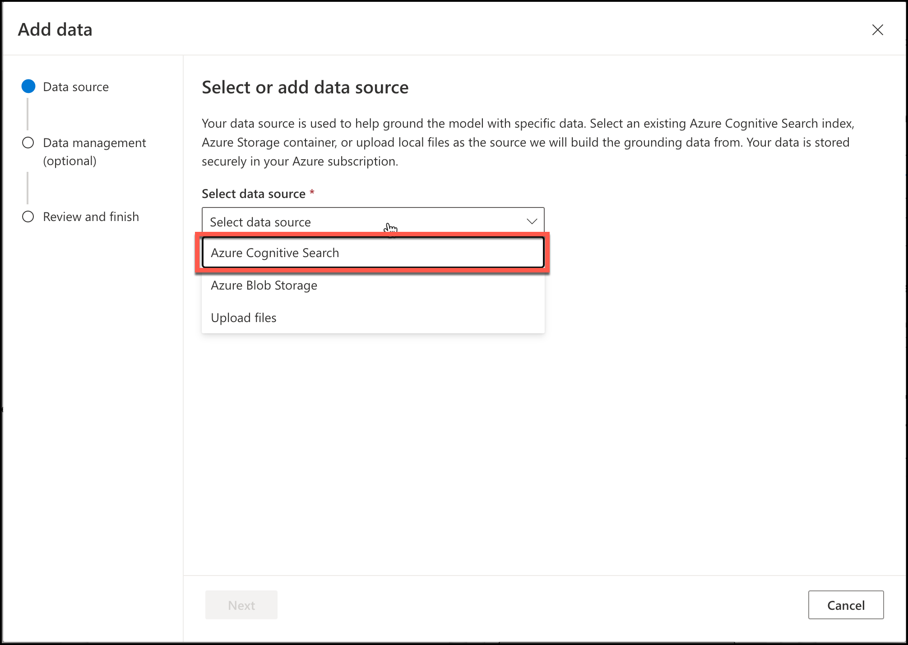

# Using Azure OpenAI Connectors API

## Summary

This (__experimental__) webpart, shows how to use the new feature (_in preview at the moment of building this sample_) Azure OpenAI Data Connectors.

The webpart is calling the Azure OpenAI API, with a specific Data source configured to an existing Azure Search service that contains the Hotels index provided by Microsoft. The following screenshots shows how you can configure the connector throught the new Azure OpenAI Studio. This is **NOT required** for the sample, but helps to understand what the webpart is doing behind the scenes.

First, you have configured your Search service (any tier except the free one) importing the Hotels data sample provided by Microsoft

Now, from the [Azure OpenAI Studio](https://oai.azure.com/portal), in the _Chat playground_, you can configure your data connector:

Connect it to your Azure Search Hotels index:

Follow the assistant to create the Connector. Once is done, you can use chatGPT to find hotels using natural language:

The webpart offers the same functionality, showing how to call the Azure OpenAI API, with a pre-configured Data source.

__Note__: this is an experimental sample, based on the preview of the Azure OpenAI service, and the preview of the Data Connectors. Ensure you check the _prerequisites_ section if you are planning to run this sample.

## Used SharePoint Framework Version

## Applies to

- [SharePoint Framework](https://aka.ms/spfx)
- [Microsoft 365 tenant](https://docs.microsoft.com/en-us/sharepoint/dev/spfx/set-up-your-developer-tenant)

## Prerequisites

  - Your Azure Subscription has the Azure OpenAI service available. You will see this message if you try to add Azure OpenAI service in your Subscription (follow the link in the Azure portal to request access).

> Azure OpenAI Service is currently available to customers via an application form. The selected subscription has not been enabled for use of the service and does not have quota for any pricing tiers. Click here to request access to Azure OpenAI service.

  - You have created an Azure OpenAI service in your subscription (create it in a US region, as some features may not be available in other regions)
  - Grab the Azure OpenAI Key (go to your _Azure OpenAI service -> Keys and Endpoint_)
  - You have configured an Azure Search service with at least a Basic plan (Free tier is not working with the Azure OpenAI Connectors feature), and have deployed the "Hotels" index that is provided as sample by Microsoft.
  - Grab the Azure Search endpoint URL (you can see it in the _Overview_ section)
  - Grab the Azure Search API key (_Keys_ section)

## Solution

| Solution    | Author(s)                                               |
| ----------- | ------------------------------------------------------- |
| react-azure-openai-connector | [Luis Mañez](https://github.com/luismanez) ([ClearPeople LTD](https://www.clearpeople.com)) |

## Version history

| Version | Date             | Comments        |
| ------- | ---------------- | --------------- |
| 1.0     | July 26, 2023 | Initial release |

## Disclaimer

**THIS CODE IS PROVIDED _AS IS_ WITHOUT WARRANTY OF ANY KIND, EITHER EXPRESS OR IMPLIED, INCLUDING ANY IMPLIED WARRANTIES OF FITNESS FOR A PARTICULAR PURPOSE, MERCHANTABILITY, OR NON-INFRINGEMENT.**

---

## Minimal Path to Awesome

- Install the MS Graph Toolkit for SPFx package. [Follow this](https://learn.microsoft.com/en-us/graph/toolkit/get-started/mgt-spfx)
- Clone this repository
- Ensure that you are at the solution folder
- Edit the file __Constants.ts__ with your values (see _prerequisites_ section)
- in the command-line run:
  - **npm install**
  - **gulp serve**
- Add the webpart in the SharePoint workbench or any SharePoint page (appending _?debug=true&noredir=true&debugManifestsFile=https://localhost:4321/temp/manifests.js_ to the page URL)

## Features

This extension illustrates the following concepts:

- Calling Azure OpenAI _completions_ endpoint with a configured Azure Search connector
- Using MS Graph toolkit with the Person component
- Multiple FluentUI components

## References

- [Azure OpenAI REST API completions endpoint](https://learn.microsoft.com/en-us/azure/ai-services/openai/reference#chat-completions)
- [MS Graph toolkit for SPFx installation](https://learn.microsoft.com/en-us/graph/toolkit/get-started/mgt-spfx)
- [Getting started with SharePoint Framework](https://docs.microsoft.com/en-us/sharepoint/dev/spfx/set-up-your-developer-tenant)
- [Building for Microsoft teams](https://docs.microsoft.com/en-us/sharepoint/dev/spfx/build-for-teams-overview)
- [Use Microsoft Graph in your solution](https://docs.microsoft.com/en-us/sharepoint/dev/spfx/web-parts/get-started/using-microsoft-graph-apis)
- [Publish SharePoint Framework applications to the Marketplace](https://docs.microsoft.com/en-us/sharepoint/dev/spfx/publish-to-marketplace-overview)
- [Microsoft 365 Patterns and Practices](https://aka.ms/m365pnp) - Guidance, tooling, samples and open-source controls for your Microsoft 365 development