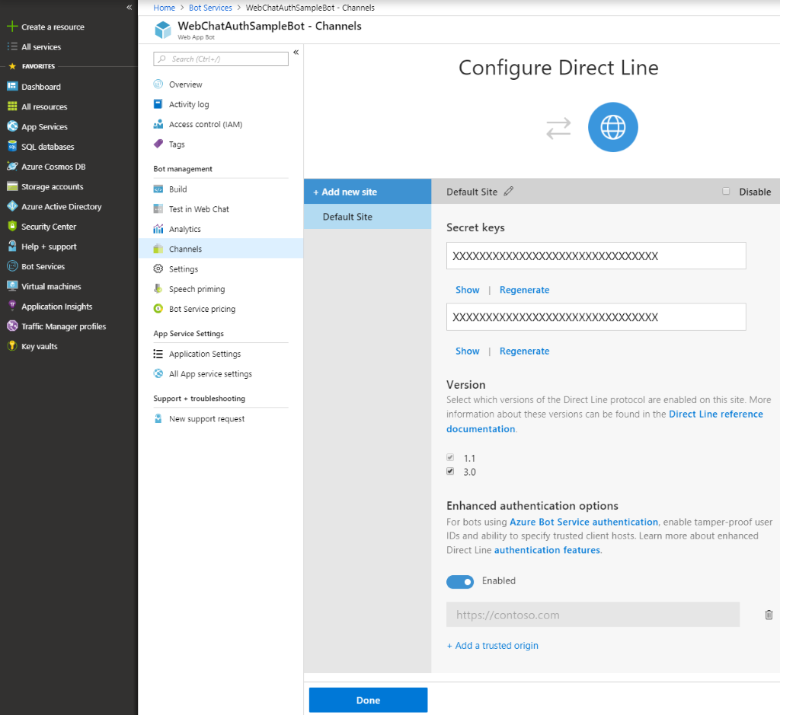

# SharePoint web part sample with bot framework -  Secure

## Summary

[Web parts](https://docs.microsoft.com/en-us/sharepoint/dev/spfx/web-parts/overview-client-side-web-parts) is a special kind of SharePoint controls that can be supported by the [Bot Framework](https://dev.botframework.com). This sample will show you how to embed a Bot Framework bot into a SharePoint web site with security consideration.

There are two parts included in this sample:

1. An echo bot sample
1. A web part sample

The web part sample embeds the echo bot by using a webchat. As web part code is running on client side, [web chat security](https://blog.botframework.com/2018/09/01/using-webchat-with-azure-bot-services-authentication/) needs to be taken into consideration. This sample shows how to secure your conversation including:

- Use Direct Line token instead of Direct Line secret
- Tamper-proof user: for user id, generate it inside client side and detect if the client has changed the user ID and reject the change.

This demo does not include any threat models and is designed for educational purposes only. When you design a production system, threat-modelling is an important task to make sure your system is secure and provide a way to quickly identify potential source of data breaches. IETF [RFC 6819](https://tools.ietf.org/html/rfc6819) and [OAuth 2.0 for Browser-Based Apps](https://tools.ietf.org/html/draft-ietf-oauth-browser-based-apps-01#section-9) is a good starting point for threat-modelling when using OAuth 2.0.


# Compatibility

 
 


-Compatible-green.svg "SharePoint Server 2016 Feature Pack 2 requires SPFx 1.1")


## Applies to

* [SharePoint Framework](https://docs.microsoft.com/sharepoint/dev/spfx/sharepoint-framework-overview)
* [Office 365 tenant](https://docs.microsoft.com/sharepoint/dev/spfx/set-up-your-development-environment)
* [Microsoft Bot Framework](https://dev.botframework.com/)

## Prerequisites

- [Node.js](https://nodejs.org) version 10.19 (Node.js v9.x, v11.x, and v12.x are not currently supported with SharePoint Framework development)

    ```bash
    # determine node version
    node --version
    ```

## Solution

Solution|Author(s)
--------|---------
webpart | Bot Framework Discussions (msbots@service.microsoft.com) <br/> Stephan Bisser (@stephanbisser, bisser.io)
bot | Bot Framework Discussions (msbots@service.microsoft.com)

## Version history

Version|Date|Comments
-------|----|--------
1.0|Nov 10, 2020|Initial release

## Disclaimer

**THIS CODE IS PROVIDED *AS IS* WITHOUT WARRANTY OF ANY KIND, EITHER EXPRESS OR IMPLIED, INCLUDING ANY IMPLIED WARRANTIES OF FITNESS FOR A PARTICULAR PURPOSE, MERCHANTABILITY, OR NON-INFRINGEMENT.**

---

## Minimal Path to Awesome

### Enlist

- Clone the repository

    ```bash
    git clone https://github.com/pnp/sp-dev-fx-webparts.git
    ```

- In a terminal, navigate to `sp-dev-fx-webparts`

    ```bash
    cd sp-dev-fx-webparts
    ```

- Navigate to the folder containing this sample

    ```bash
    cd samples
    cd react-bot-framework-secure
    ```


### [Setup bot](./bot/README.md)

- Go to `./bot`
- Install modules

    ```bash
    npm install
    ```

- Start the bot. You can use emulator to verify whether the bot works

    ```bash
    npm start
    ```

- Register connections. You can get it done by [deploy your bot to Azure](https://aka.ms/azuredeployment). Save your bot service endpoint like: "https://YOUR_BOT.azurewebsites.net". Save your AAD Id as `YOUR_APP_ID` and secret as `YOUR_APP_PSW` also.

- [Connect to direct line](https://docs.microsoft.com/en-us/azure/bot-service/bot-service-channel-connect-directline?view=azure-bot-service-4.0), copy one of the Secret Key values as YOUR_DIRECT_LINE_SECRET and store this for later. This is your ‘Direct Line Secret’.

- Add `DirectLineSecret` to an `.env` config file under `./bot`

    ```bash
    MicrosoftAppId=YOUR_APP_ID
    MicrosoftAppPassword=YOUR_APP_PSW
    DirectLineSecret=YOUR_DIRECT_LINE_SECRET
    ```

- Restart your bot in local or redeploy your bot with new config.

### [Setup web part](./webpart/README.md)

- Go to `./webpart`
- Install modules

    ```bash
    npm install
    ```

- Start web part

    ```bash
    gulp serve
    ```

    Now web part is running locally in https://localhost:4321.

- (Opt.) Publish the bot: follow the steps outlined in the [Deploy your bot](https://docs.microsoft.com/en-us/azure/bot-service/bot-builder-deploy-az-cli?view=azure-bot-service-4.0&tabs=csharp) article.

- (Opt.) Config CORS \
  [CORS](https://en.wikipedia.org/wiki/Cross-origin_resource_sharing) must be set on bot app service to enable SharePoint client to get resource from bot service. Follow these steps to add your workbench to bot app service CORS configuration:
    1. Go to your azure portal
    1. Navigate to your bot app service, search for CORS settings
    1. Add https://localhost:4321 and https://<YOUR_SITE>.sharepoint.com to CORS origins

- Config bot endpoint \
    Add the web part, set bot endpoint to https://localhost:4321 (local) or https://YOUR_BOT.azurewebsites.net (remote), refresh this page, then you can successfully connect bot with SharePoint.

## Features

**Web Chat integration with security consideration**

The SharePoint component will integrate bot with react Web Chat component.  

```tsx
public render(): React.ReactElement<IBotFrameworkChatv4Props> {
    return (
        <div className={styles.botFrameworkChatv4} style={{ height: 700 }}>
            <ReactWebChat directLine={directLine} styleOptions={styleSetOptions} />
        </div>
    );
}
```

 Inside Web Chat, direct line will be used to connect to Bot Service. On Bot Service side, one more endpoint `directline/token` will be added besides `api/messages`, which will accept userId passed from client side and return back direct line token.

 For production, this endpoint should also verify if the incoming request is authorized.

```tsx
server.post('/directline/token', (req, res) => {
    const secret = settings.parsed.DirectLineSecret;
    const authorization = `Bearer ${secret}`;

    const userId = 'dl_' + GetUserId((req.body || {}).user);
    const options = {
        method: 'POST',
        uri: 'https://directline.botframework.com/v3/directline/tokens/generate',
        body: JSON.stringify({ user: { id: userId} }),
        headers: { 'Authorization': authorization, 'Content-Type': 'application/json'}
        };+

    request.post(options, (error, response, body) => {
        if (!error && response.statusCode < 300) {
            res.status(response.statusCode);
            if (body) { res.send(JSON.parse(body)) }
        } else {
            res.status(500);
            res.send('Call to retrieve token from DirectLine failed');
        }
        res.end();
    });
});
```

On web part side, it will fetch direct line token from bot service side with SharePoint `userId` then build up the web chat component. The `UserId` should be encrypted so it won't be easy to get other user's token by bot endpoint.

```tsx
useEffect(() => {
    const userId = props.context.pageContext.user.loginName;
    generateToken(props.botEndpoint, md5(userId)).then((token: string) => {
        if (token) {
          setDirectLine(createDirectLine({ token }));
        }
    });
}, []);
```

And enable "Enhanced authentication options" can help detect client user Id change then reject the change:
\
For how to find this option, please refer [connect to direct line](https://docs.microsoft.com/en-us/azure/bot-service/bot-service-channel-connect-directline?view=azure-bot-service-4.0).

## Further reading

- [SharePoint Web Parts Development Basics](https://docs.microsoft.com/en-us/sharepoint/dev/spfx/web-parts/overview-client-side-web-parts)
- [Bot Framework Documentation](https://docs.botframework.com)
- [Bot Basics](https://docs.microsoft.com/azure/bot-service/bot-builder-basics?view=azure-bot-service-4.0)
- [Azure Bot Service Introduction](https://docs.microsoft.com/azure/bot-service/bot-service-overview-introduction?view=azure-bot-service-4.0)
- [Azure Bot Service Documentation](https://docs.microsoft.com/azure/bot-service/?view=azure-bot-service-4.0)
- [Channels and Bot Connector Service](https://docs.microsoft.com/en-us/azure/bot-service/bot-concepts?view=azure-bot-service-4.0)
- [Restify](https://www.npmjs.com/package/restify)
- [Using WebChat with Azure Bot Service’s Authentication](https://blog.botframework.com/2018/09/01/using-webchat-with-azure-bot-services-authentication/)


