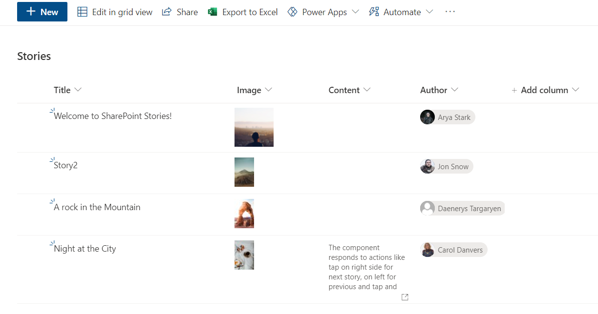

http://aka.ms/m365devprogramhttp://aka.ms/m365devprogramhttp://aka.ms/m365devprogramhttp://aka.ms/m365devprogram# Company Stories

## Summary

This web part allows you to add images to a SharePoint List, and renders them with a UX very similar to Instagram Stories (or Twitter Reels, or [Place your Social network here]). It is a way to engage employees, showing relevant content in a well-known visual appearance.

## Compatibility

| :warning: Important          |
|:---------------------------|
| Every SPFx version is only compatible with specific version(s) of Node.js. In order to be able to build this sample, please ensure that the version of Node on your workstation matches one of the versions listed in this section. This sample will not work on a different version of Node.|
|Refer to <https://aka.ms/spfx-matrix> for more information on SPFx compatibility.   |

-Incompatible-red.svg "SharePoint Server 2016 Feature Pack 2 requires SPFx 1.1")

## Applies to

- [SharePoint Framework](https://aka.ms/spfx)
- [Microsoft 365 tenant](https://learn.microsoft.com/sharepoint/dev/spfx/set-up-your-developer-tenant)

> Get your own free development tenant by subscribing to [Microsoft 365 developer program](http://aka.ms/o365devprogram)

## Prerequisites

- Before deploying your SharePoint Framework package to your tenant, you will need to deploy the @microsoft/mgt-spfx SharePoint Framework package to your tenant. You can download the package corresponding to the version of @microsoft/mgt-spfx that you used in your project, from the [Releases](https://github.com/microsoftgraph/microsoft-graph-toolkit/releases) section on GitHub.
See here for more information about using Microsoft Graph Toolkit components in SPFx: <https://docs.microsoft.com/en-gb/graph/toolkit/get-started/mgt-spfx>
- A SharePoint list called "Stories" with the following fields:
  - Image: image field type
  - Content: multi-line field type
  - Author: Person field type

- Permission _User.ReadBasic.All_ to the Graph API

## Solution

Solution|Author(s)
--------|---------
react-company-stories | Luis Mañez (MVP, [ClearPeople](http://www.clearpeople.com), @luismanez)

## Version history

Version|Date|Comments
-------|----|--------
1.0|March 31, 2021|Initial release
2.0|March 16, 2022|Upgraded to SPFx v1.14. Issue 2442 fixed. Using latest MGT version

## Minimal path to awesome

- Before deploying your SharePoint Framework package to your tenant, you will need to deploy the @microsoft/mgt-spfx SharePoint Framework package to your tenant. You can download the package corresponding to the version of @microsoft/mgt-spfx that you used in your project, from the [Releases](https://github.com/microsoftgraph/microsoft-graph-toolkit/releases) section on GitHub.
See here for more information about using Microsoft Graph Toolkit components in SPFx: <https://docs.microsoft.com/en-gb/graph/toolkit/get-started/mgt-spfx>
- Configure SharePoint permissions to Graph API (see Prerequisites). Suggest you to use the [Microsoft 365 CLI](https://blog.mastykarz.nl/grant-api-permissions-office-365-cli/)
- Clone this repository (or [download this solution as a .ZIP file](https://pnp.github.io/download-partial/?url=https://github.com/pnp/sp-dev-fx-webparts/tree/main/samples/react-company-stories) then unzip it)
- From your command line, change your current directory to the directory containing this sample (`react-company-stories`, located under `samples`)
- In the command-line run:
  - `npm install`
  - `gulp serve --nobrowser`
- Add the web part to the SharePoint Workbench (same Site where the List was created)

> This sample can also be opened with [VS Code Remote Development](https://code.visualstudio.com/docs/remote/remote-overview). Visit <https://aka.ms/spfx-devcontainer> for further instructions.

## Features

This web part illustrates the following concepts:

- Using the Microsoft Graph Toolkit react components: [Person component](https://learn.microsoft.com/graph/toolkit/components/person)
- Using FluentUI components
- Using [react-insta-stories](https://www.npmjs.com/package/react-insta-stories) package
- Using SP REST API

## References

About SPFx:

- [Getting started with SharePoint Framework](https://learn.microsoft.com/sharepoint/dev/spfx/set-up-your-developer-tenant)
- [Building for Microsoft teams](https://learn.microsoft.com/sharepoint/dev/spfx/build-for-teams-overview)
- [Use Microsoft Graph in your solution](https://learn.microsoft.com/sharepoint/dev/spfx/web-parts/get-started/using-microsoft-graph-apis)
- [Publish SharePoint Framework applications to the Marketplace](https://learn.microsoft.com/sharepoint/dev/spfx/publish-to-marketplace-overview)
- [Microsoft 365 Patterns and Practices](https://aka.ms/m365pnp) - Guidance, tooling, samples and open-source controls for your Microsoft 365 development

## Help

We do not support samples, but this community is always willing to help, and we want to improve these samples. We use GitHub to track issues, which makes it easy for  community members to volunteer their time and help resolve issues.

If you're having issues building the solution, please run [spfx doctor](https://pnp.github.io/cli-microsoft365/cmd/spfx/spfx-doctor/) from within the solution folder to diagnose incompatibility issues with your environment.

You can try looking at [issues related to this sample](https://github.com/pnp/sp-dev-fx-webparts/issues?q=label%3A%22sample%3A%20react-company-stories%22) to see if anybody else is having the same issues.

You can also try looking at [discussions related to this sample](https://github.com/pnp/sp-dev-fx-webparts/discussions?discussions_q=react-company-stories) and see what the community is saying.

If you encounter any issues while using this sample, [create a new issue](https://github.com/pnp/sp-dev-fx-webparts/issues/new?assignees=&labels=Needs%3A+Triage+%3Amag%3A%2Ctype%3Abug-suspected%2Csample%3A%20react-company-stories&template=bug-report.yml&sample=react-company-stories&authors=@luismanez&title=react-company-stories%20-%20).

For questions regarding this sample, [create a new question](https://github.com/pnp/sp-dev-fx-webparts/issues/new?assignees=&labels=Needs%3A+Triage+%3Amag%3A%2Ctype%3Aquestion%2Csample%3A%20react-company-stories&template=question.yml&sample=react-company-stories&authors=@luismanez&title=react-company-stories%20-%20).

Finally, if you have an idea for improvement, [make a suggestion](https://github.com/pnp/sp-dev-fx-webparts/issues/new?assignees=&labels=Needs%3A+Triage+%3Amag%3A%2Ctype%3Aenhancement%2Csample%3A%20react-company-stories&template=suggestion.yml&sample=react-company-stories&authors=@luismanez&title=react-company-stories%20-%20).

## Disclaimer

**THIS CODE IS PROVIDED _AS IS_ WITHOUT WARRANTY OF ANY KIND, EITHER EXPRESS OR IMPLIED, INCLUDING ANY IMPLIED WARRANTIES OF FITNESS FOR A PARTICULAR PURPOSE, MERCHANTABILITY, OR NON-INFRINGEMENT.**

