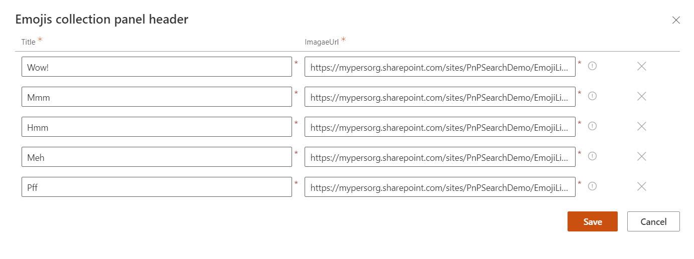

# react-emoji-ratings

## Summary

This is sample web part which can be used to take emoji based reaction or feedback for particular news/article/posts.
We all know every organizations would be using SharePoint news features for company's internal communications from HR to IT updates and some time annoucements. News created in SharePoint are created as Pages in library. Idea behind this webpart is to take employee/user's feedback as emoji reactions on particular news. This webpart can also be used on wiki articles or blog posts to take similar reactions. Webpart uses concept of 1 to 5 star based rating system(configurable), you can decide low to high based on your preference.

Ideally, we can do some automation using PnP Powershell and PowerAutomate(trigger when item is created ) to add this webpart to any every news that is published.

If you wish to directly use the package in your tenant here is [link](https://github.com/siddharth-vaghasia/public-docs/blob/master/react-emoji-reaction-rating.sppkg) to download.

 

## Features

* Configurable header text, rating text, and images
* We can choose to show from minimum one rating to max 5 rating images and text
* Option to show total count of particular rating count as badge
* Option to show and capture comments from user when submitting feedback
* Display current user's rating selection with highlighted background
* Allow user to change rating(update rating)
* Stores ratings in SharePoint List
* Option to create list on the fly and choose list to store the ratings
* Option for admin to choose background color

## Technical Notes

* User's rating data would be stored in SP List, below are list of columns and its relevance

1. Title : To store user's display name(not required though)
2. Page Name : To store page on which rating is given by particular user, this will have absolute url of page
3. User : To store user who has given feedback for particular page/news where webpart is added
4. Comment : To store comment provided by user while submitting reaction.
5. Then there are 5 columns Rating1, Rating2, Rating3, Rating4, Rating5 which will store the rating text configured by admin in webpart... Only one of this 5 columns would be populated for single item in list, which is what user has selected as part of giving reaction

* Below is how you can configure emoji's text and its image url

I have added default emoji's images which can be used and uploaded to SharePoint library in the assets folder of this solution.

## Used SharePoint Framework Version

## Applies to

- [SharePoint Framework](https://aka.ms/spfx)
- [Microsoft 365 tenant](https://docs.microsoft.com/en-us/sharepoint/dev/spfx/set-up-your-developer-tenant)

> Get your own free development tenant by subscribing to [Microsoft 365 developer program](http://aka.ms/o365devprogram)

## Prerequisites

* SharePoint Online tenant
* Permission to deploy package to Tenant or SharePoint Site collection app catalog

## Solution

Solution|Author(s)
--------|---------
react-emoji-ratings | Siddharth Vaghasia(@siddh_me)

## Version history

Version|Date|Comments
-------|----|--------
1.0|Sep 04, 2021|Initial release

## Disclaimer

**THIS CODE IS PROVIDED *AS IS* WITHOUT WARRANTY OF ANY KIND, EITHER EXPRESS OR IMPLIED, INCLUDING ANY IMPLIED WARRANTIES OF FITNESS FOR A PARTICULAR PURPOSE, MERCHANTABILITY, OR NON-INFRINGEMENT.**

---

## Minimal Path to Awesome

- Clone this repository
- Ensure that you are at the solution folder
- in the command-line run:
  - **npm install**
  - **gulp serve**

## References

- [Getting started with SharePoint Framework](https://docs.microsoft.com/en-us/sharepoint/dev/spfx/set-up-your-developer-tenant)
- [Building for Microsoft teams](https://docs.microsoft.com/en-us/sharepoint/dev/spfx/build-for-teams-overview)
- [Publish SharePoint Framework applications to the Marketplace](https://docs.microsoft.com/en-us/sharepoint/dev/spfx/publish-to-marketplace-overview)
- [Microsoft 365 Patterns and Practices](https://aka.ms/m365pnp) - Guidance, tooling, samples and open-source controls for your Microsoft 365 development

