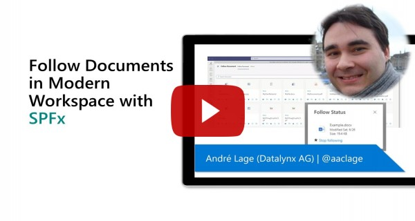

# Follow Document

## Summary

This solution has the goal to easily identify/follow user key documents from all Tenant and easily access them in Modern Pages and Microsoft Teams. This solution uses the Out of Box Office Page >  Favorites Files Tab with combination of MSGraph queries and extension for Microsoft Teams.

This is a 2 phase project with associated dependency of solution [Follow-Document](https://github.com/pnp/sp-dev-fx-extensions/tree/main/samples/react-command-follow-document) extension where users are allow to select and manage Followed Document in Libraries to be used in this project. 

Available features:
- Display Follow Documents as Document Card Grid.
- Click on icon redirects to Document.
- Click on Site name redirects to Site.
- Team icon, Form to send message with html to Teams using adaptive cards. 
- Folder Icon redirects to Library where document is located.
- Filled Start allow user to unfollow document.
- Info icon open the Properties of Document with capability to edit.
- Document with search icon allow to preview Document in Side Panel.
- Search by Filename.
- Grouping by Site.
- Microsoft Team integration with personal/Tab App that allow user focus on key Documents. 

Usage of following Technologies:
- Usage of Microsoft Graph API "[Follow drive item](https://docs.microsoft.com/en-us/graph/api/driveitem-follow?view=graph-rest-1.0&tabs=http)"
- Usage of Microsoft Graph API "[Unfollow drive item](https://docs.microsoft.com/en-us/graph/api/driveitem-unfollow?view=graph-rest-1.0&tabs=http)"
- Usage of Microsoft Graph API "[List followed items](https://docs.microsoft.com/en-us/graph/api/drive-list-following?view=graph-rest-1.0&tabs=http)"- Usage of Graph queries using  [Graph explorer](https://developer.microsoft.com/en-us/graph/graph-explorer)
- Usage of  [adaptive cards](https://adaptivecards.io/)
- Microsoft Teams integration with following option [TeamsTab, TeamsPersonalApp]


## Compatibility


 


-Incompatible-red.svg "SharePoint Server 2016 Feature Pack 2 requires SPFx 1.1")

-yellow.svg)

## Applies to

- [SharePoint Framework](https://aka.ms/spfx)
- [Microsoft 365 tenant](https://docs.microsoft.com/en-us/sharepoint/dev/spfx/set-up-your-developer-tenant)

> Get your own free development tenant by subscribing to [Microsoft 365 developer program](http://aka.ms/o365devprogram)

## Prerequisites

### Grant the service principal permission to the Microsoft Graph API

Once installed, the solution will request the required permissions via the **Office 365 admin portal > SharePoint > Advanced > API access**.
If you prefer to approve the permissions in advance, for example when testing the solution in the Workbench page without installing it, you can do so using the [CLI for Microsoft 365](https://pnp.github.io/cli-microsoft365/):

```bash
o365 spo login https://contoso-admin.sharepoint.com
o365 spo serviceprincipal grant add --resource 'Microsoft Graph' --scope 'Files.Read'
o365 spo serviceprincipal grant add --resource 'Microsoft Graph' --scope 'Files.Read.All'
o365 spo serviceprincipal grant add --resource 'Microsoft Graph' --scope 'Sites.Read.All'
o365 spo serviceprincipal grant add --resource 'Microsoft Graph' --scope 'Files.ReadWrite.All'
o365 spo serviceprincipal grant add --resource 'Microsoft Graph' --scope 'Sites.ReadWrite.All'
o365 spo serviceprincipal grant add --resource 'Microsoft Graph' --scope 'Team.ReadBasic.All'
o365 spo serviceprincipal grant add --resource 'Microsoft Graph' --scope 'Channel.ReadBasic.All'
o365 spo serviceprincipal grant add --resource 'Microsoft Graph' --scope 'ChannelMessage.Send'
```

## Solution

Solution|Author(s)
--------|---------
react-follow-document | [André Lage](https://github.com/aaclage) (http://aaclage.blogspot.com, [@aaclage](https://twitter.com/aaclage))

## Version history

Version|Date|Comments
-------|----|--------
1.0|June 22, 2021|Initial release
2.0|November 25, 2021|Change to use Microsoft Graph Follow
3.0|January 13, 2022|Graph fixes

## Minimal Path to Awesome

- Clone this repository
- Ensure that you are at the solution folder
- in the command-line run:
  - `npm install`
  - `gulp serve`
  - `gulp bundle --ship`
  - `gulp package-solution --ship`
  - Add to AppCatalog and deploy

## Features

Description of the extension that expands upon high-level summary above.

This extension illustrates the following concepts:

- Usage of Office > Favorites to follow key Documents from users in Modern Sites. 
- Simple UX to manage **Followed** documents and report list followed documents across Tenant and access properties and Preview of Document.
- Option to unfollow documents individually. 
- Integration with other services of Office 365 such us (Preview, Microsoft Team Messages).  

## Video

[](https://www.youtube.com/watch?v=Wx7nqlP3WQU "Follow Documents in Modern Workspace with SPFx")


## Help

We do not support samples, but this community is always willing to help, and we want to improve these samples. We use GitHub to track issues, which makes it easy for  community members to volunteer their time and help resolve issues.

If you're having issues building the solution, please run [spfx doctor](https://pnp.github.io/cli-microsoft365/cmd/spfx/spfx-doctor/) from within the solution folder to diagnose incompatibility issues with your environment.

You can try looking at [issues related to this sample](https://github.com/pnp/sp-dev-fx-webparts/issues?q=label%3A%22sample%3A%20react-follow-document") to see if anybody else is having the same issues.

You can also try looking at [discussions related to this sample](https://github.com/pnp/sp-dev-fx-webparts/discussions?discussions_q=react-follow-document) and see what the community is saying.

If you encounter any issues while using this sample, [create a new issue](https://github.com/pnp/sp-dev-fx-webparts/issues/new?assignees=&labels=Needs%3A+Triage+%3Amag%3A%2Ctype%3Abug-suspected%2Csample%3A%20react-follow-document&template=bug-report.yml&sample=react-follow-document&authors=@aaclage&title=react-follow-document%20-%20).

For questions regarding this sample, [create a new question](https://github.com/pnp/sp-dev-fx-webparts/issues/new?assignees=&labels=Needs%3A+Triage+%3Amag%3A%2Ctype%3Aquestion%2Csample%3A%20react-follow-document&template=question.yml&sample=react-follow-document&authors=@aaclage&title=react-follow-document%20-%20).

Finally, if you have an idea for improvement, [make a suggestion](https://github.com/pnp/sp-dev-fx-webparts/issues/new?assignees=&labels=Needs%3A+Triage+%3Amag%3A%2Ctype%3Aenhancement%2Csample%3A%20react-follow-document&template=question.yml&sample=react-follow-document&authors=@aaclage&title=react-follow-document%20-%20).

## References

- [Getting started with SharePoint Framework](https://docs.microsoft.com/en-us/sharepoint/dev/spfx/set-up-your-developer-tenant)
- [Building for Microsoft teams](https://docs.microsoft.com/en-us/sharepoint/dev/spfx/build-for-teams-overview)
- [Use Microsoft Graph in your solution](https://docs.microsoft.com/en-us/sharepoint/dev/spfx/web-parts/get-started/using-microsoft-graph-apis)
- [Publish SharePoint Framework applications to the Marketplace](https://docs.microsoft.com/en-us/sharepoint/dev/spfx/publish-to-marketplace-overview)
- [Microsoft 365 Patterns and Practices](https://aka.ms/m365pnp) - Guidance, tooling, samples and open-source controls for your Microsoft 365 development

## Disclaimer

**THIS CODE IS PROVIDED *AS IS* WITHOUT WARRANTY OF ANY KIND, EITHER EXPRESS OR IMPLIED, INCLUDING ANY IMPLIED WARRANTIES OF FITNESS FOR A PARTICULAR PURPOSE, MERCHANTABILITY, OR NON-INFRINGEMENT.**


