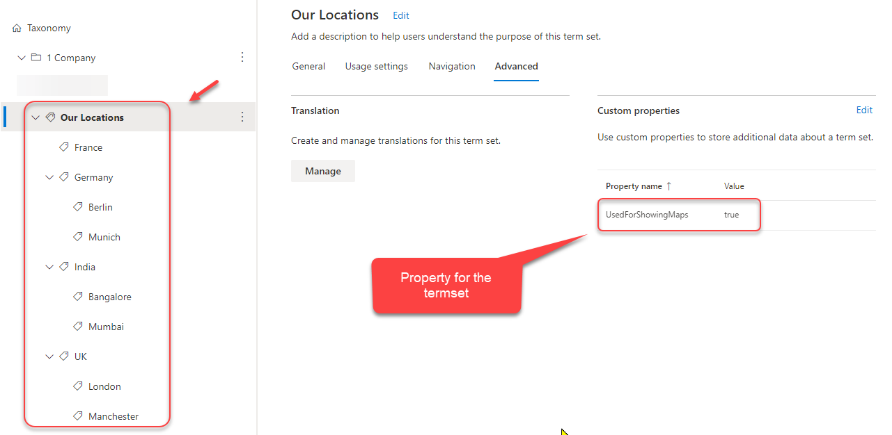
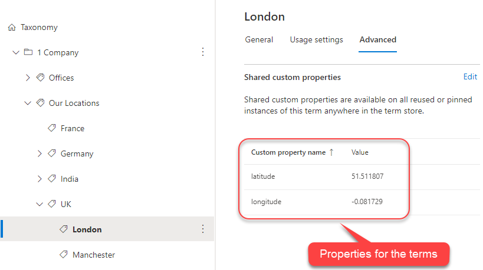

# Cascading managed metadata using Graph API (beta)

## Summary

This web part shows how to use the Microsoft Graph APIs (beta) for Taxonomy to get the data.

### Functionality

## Compatibility

| :warning: Important          |
|:---------------------------|
| Every SPFx version is only compatible with specific version(s) of Node.js. In order to be able to build this sample, please ensure that the version of Node on your workstation matches one of the versions listed in this section. This sample will not work on a different version of Node.|
|Refer to <https://aka.ms/spfx-matrix> for more information on SPFx compatibility.   |

-Incompatible-red.svg "SharePoint Server 2016 Feature Pack 2 requires SPFx 1.1")

## Applies to

* [SharePoint Framework Developer](https://learn.microsoft.com/sharepoint/dev/spfx/sharepoint-framework-overview)
* [Office 365 developer tenant](https://learn.microsoft.com/sharepoint/dev/spfx/set-up-your-developer-tenant)

## Pre-requisites

* Set up the termset structure as shown in the image below - .
* To the termset, add a custom property called `UsedForShowingMaps` and set it's value to `true` as shown in the image below
  
* For the cities, get the required latitude and longitude.
* Add 2 custom properties for the city terms `latitude` and `longitude` (as highlighted for the term `London` in the image below).
  

## Solution

Solution|Author(s)
--------|---------
react-graph-cascading-managed-metadata| Anoop Tatti ([anoopt](https://github.com/anoopt), ([https://linktr.ee/anoopt](https://linktr.ee/anoopt))

## Version history

Version|Date|Comments
-------|----|--------
1.0.0|Aug 24, 2020|Initial release
1.0.1|Sep 03, 2020|Error handling and logging improvements
2.0.0|Mar 04, 2022|Updated to SPFx 1.14, used term `custom properties` to get co-ordinates (as Graph API provides that capability now), usage of `PropertyFieldGuid` and several other improvements

## Minimal Path to Awesome

* Clone this repository
* in the command line run:
  * `npm install`
  * `gulp serve`
* Make sure you have completed the [pre-requisites](#Pre-requisites)
* Add the web part to the workbench page of a site
* Edit the web part and add the termset id in the properties

> This sample can also be opened with [VS Code Remote Development](https://code.visualstudio.com/docs/remote/remote-overview). Visit <https://aka.ms/spfx-devcontainer> for further instructions.

## Features

This sample illustrates the following concepts on top of the SharePoint Framework:

* Get termset, terms and their custom properties using Microsoft Graph API (beta).
* React Hooks
* Using async / await for the async calls
* Caching the data in session storage
* Usage of PnP SPFx controls (Maps and Placeholder)
* Office UI fabric components

### Enhancements

* Currently, this web part supports 2-level cascading. So there is scope to enhance this such that it supports more levels of cascading dynamically.

## Video

## Need to show more details?

An Adaptive Card Extension (ACE) which performs similar operations and provides more data like the local time of the office, weather data of the office location and address of the office location along with it's map can be found in the `Office locations` sample of [pnp/sp-dev-fx-aces repostory](https://github.com/pnp/sp-dev-fx-aces/tree/main/samples/ImageCard-OfficeLocations).

## Help

We do not support samples, but we this community is always willing to help, and we want to improve these samples. We use GitHub to track issues, which makes it easy for  community members to volunteer their time and help resolve issues.

If you're having issues building the solution, please run [spfx doctor](https://pnp.github.io/cli-microsoft365/cmd/spfx/spfx-doctor/) from within the solution folder to diagnose incompatibility issues with your environment.

If you encounter any issues while using this sample, [create a new issue](https://github.com/pnp/sp-dev-fx-webparts/issues/new?assignees=&labels=Needs%3A+Triage+%3Amag%3A%2Ctype%3Abug-suspected%2Csample%3A%20react-graph-cascading-managed-metadata&template=bug-report.yml&sample=react-graph-cascading-managed-metadata&authors=@anoopt&title=react-graph-cascading-managed-metadata%20-%20).

For questions regarding this sample, [create a new question](https://github.com/pnp/sp-dev-fx-webparts/issues/new?assignees=&labels=Needs%3A+Triage+%3Amag%3A%2Ctype%3Aquestion%2Csample%3A%20react-graph-cascading-managed-metadata&template=question.yml&sample=react-graph-cascading-managed-metadata&authors=@anoopt&title=react-graph-cascading-managed-metadata%20-%20).

Finally, if you have an idea for improvement, [make a suggestion](https://github.com/pnp/sp-dev-fx-webparts/issues/new?assignees=&labels=Needs%3A+Triage+%3Amag%3A%2Ctype%3Aenhancement%2Csample%3A%20react-graph-cascading-managed-metadata&template=question.yml&sample=react-graph-cascading-managed-metadata&authors=@anoopt&title=react-graph-cascading-managed-metadata%20-%20).

## Disclaimer

**THIS CODE IS PROVIDED *AS IS* WITHOUT WARRANTY OF ANY KIND, EITHER EXPRESS OR IMPLIED, INCLUDING ANY IMPLIED WARRANTIES OF FITNESS FOR A PARTICULAR PURPOSE, MERCHANTABILITY, OR NON-INFRINGEMENT.**

