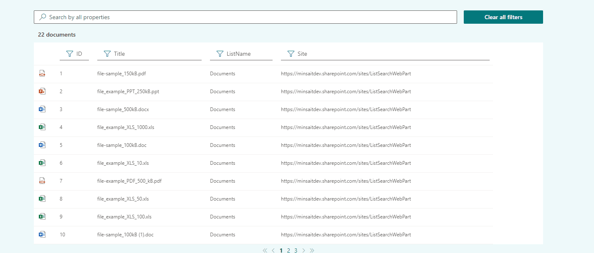
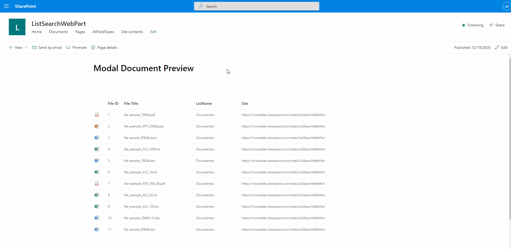
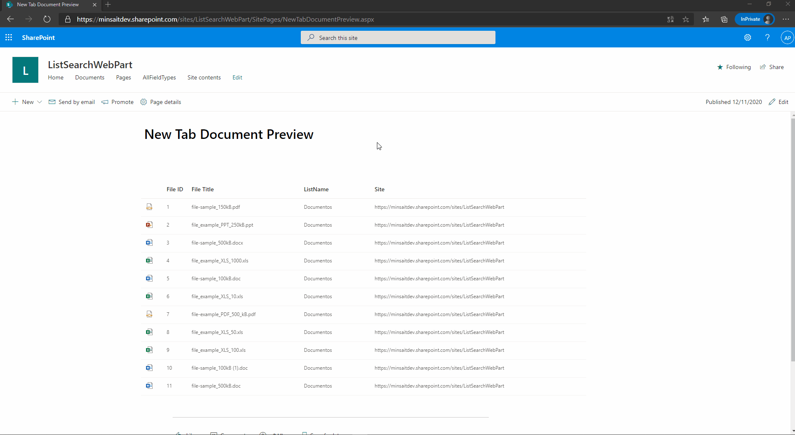
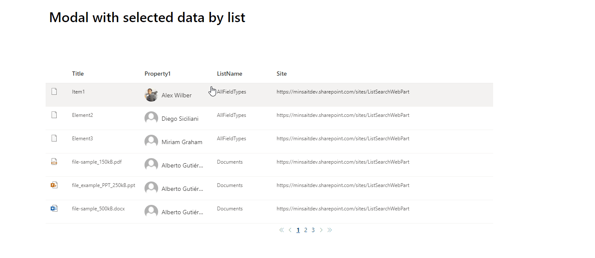

# List Search

## Summary

This list search web part allows the user to show data from lists or libraries. The web part can be used to (for more details see images below):
  * [Show merged items from diferents lists/libraries](#merge-items-from-different-listslibraries)
  * [Open item data in modal window (same data shown in the table)](#merge-items-from-different-listslibraries)
  * [Select render by field type](#select-render-of-the-selected-fields)
  * [Open item detail in modal window (it allows to select the fields to show by list)](#open-selected-item-with-selected-properties)
  * [Open documents in modal window](#open-documents-in-modal-window)
  * [Open documents in new tab](#open-documents-in-new-tab)
  * [Use of dynamic data](#use-of-dynamic-data)
  * [Redirect to url](#redirect-to-url-depends-on-selected-item)

* Other useful functionalities:
  * List item modern audience support
  * General filter - the user can select which columns are filtered and which not
  * Column filter on each column
  * Item limit to show
  * Item pagination
  * Group items by any field
  * Cache to retrieve the items
  * Get section color
  * Show item count with custom message

#### Merge items from different lists/libraries

#### Select render of the selected fields

#### Open documents in modal window

#### Open documents in new tab

#### Use of dynamic data

#### Open selected item with same data

#### Open selected item with selected properties

#### Redirect to url depends on selected item

## Compatibility

 
 
 

## Applies to

* [SharePoint Framework](https://docs.microsoft.com/sharepoint/dev/spfx/sharepoint-framework-overview)
* [Office 365 tenant](https://docs.microsoft.com/sharepoint/dev/spfx/set-up-your-development-environment)

## Solution

Solution|Author(s)
--------|---------
react-list-search | Alberto Gutiérrez ([@albertogperez](https://twitter.com/albertogperez))

## Version history

Version|Date|Comments
-------|----|--------
1.0.0|December 20, 2020|Initial release
1.1.0|April 25, 2021|List item modern audience support

## Disclaimer

**THIS CODE IS PROVIDED *AS IS* WITHOUT WARRANTY OF ANY KIND, EITHER EXPRESS OR IMPLIED, INCLUDING ANY IMPLIED WARRANTIES OF FITNESS FOR A PARTICULAR PURPOSE, MERCHANTABILITY, OR NON-INFRINGEMENT.**

---

## Minimal Path to Awesome

### Dev Mode

  * Clone this repository
  * In the command line run:
    * Navigate to `list-search-webpart`
    * `npm install`
    * `gulp serve`
    * Open the *workbench* on your Office 365 Developer tenant
    * Test out the web part

### Sppkg

  * Download `.sppkg` files from `sppkg` folder
  * Upload files to **App Catalog**
  * Approve the API permissions in the new SP admin center (only needed if you are going to enable list item modern audience)

## Features

This Web Part illustrates the following concepts on top of the SharePoint Framework:

* Using react for building SharePoint Framework client-side web parts
* Using [PnP Js](https://pnp.github.io/pnpjs) to retrieve SharePoint data
* Using [PnP Js](https://pnp.github.io/pnpjs/odata/caching) to cache SharePoint data
* Connection between SharePoint Framework components using dynamic data
* [Support of section backgrounds color ](https://docs.microsoft.com/en-us/sharepoint/dev/spfx/web-parts/guidance/supporting-section-backgrounds)
* [Custom property pane control](https://docs.microsoft.com/en-us/sharepoint/dev/spfx/web-parts/guidance/build-custom-property-pane-controls)
* Use [react-js-pagination](https://www.npmjs.com/package/react-js-pagination) library

