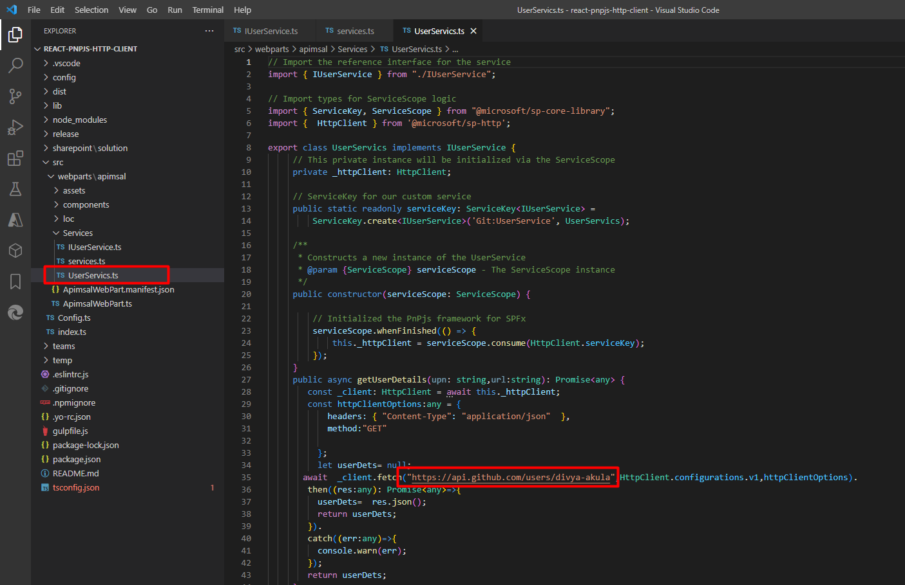

# GitHub Profile display via API

## Summary

This web part loads the GitHub profile using SPHttp client in PnP v3.

To change the profile or to use your own API follow the below path

## Compatibility

| :warning: Important          |
|:---------------------------|
| Every SPFx version is only compatible with specific version(s) of Node.js. In order to be able to build this sample, please ensure that the version of Node on your workstation matches one of the versions listed in this section. This sample will not work on a different version of Node.|
|Refer to <https://aka.ms/spfx-matrix> for more information on SPFx compatibility.   |

## Used SharePoint Framework Version

## Applies to

- [PnPjs V3](https://pnp.github.io/pnpjs/)
- [SharePoint Framework](https://aka.ms/spfx)
- [Microsoft 365 tenant](https://docs.microsoft.com/en-us/sharepoint/dev/spfx/set-up-your-developer-tenant)

> Get your own free development tenant by subscribing to [Microsoft 365 developer program](http://aka.ms/o365devprogram)

## Contributors

- [Divya Akula](https://github.com/divya-akula/)  [@divya-akula](https://twitter.com/_divyaakula)

## Version history

| Version | Date             | Comments        |
| ------- | ---------------- | --------------- |
| 1.0     | March 07, 2023   | Initial release  |

## Minimal path to awesome

- Clone this repository (or [download this solution as a .ZIP file](https://pnp.github.io/download-partial/?url=https://github.com/pnp/sp-dev-fx-webparts/tree/main/samples/react-pnpjs-http-client) then unzip it)
- From your command line, change your current directory to the directory containing this sample (`react-pnpjs-http-client`, located under `samples`)
- in the command line run:
  - `npm install`
  - `gulp serve`

> This sample can also be opened with [VS Code Remote Development](https://code.visualstudio.com/docs/remote/remote-overview). Visit <https://aka.ms/spfx-devcontainer> for further instructions.

## Features

Description of the extension that expands upon high-level summary above.

This extension illustrates the following concepts:

- invoking third party API
- PnPjs v3
- Document card layout

## References

- [Getting started with SharePoint Framework](https://docs.microsoft.com/en-us/sharepoint/dev/spfx/set-up-your-developer-tenant)
- [Building for Microsoft teams](https://docs.microsoft.com/en-us/sharepoint/dev/spfx/build-for-teams-overview)
- [Use Microsoft Graph in your solution](https://docs.microsoft.com/en-us/sharepoint/dev/spfx/web-parts/get-started/using-microsoft-graph-apis)
- [Publish SharePoint Framework applications to the Marketplace](https://docs.microsoft.com/en-us/sharepoint/dev/spfx/publish-to-marketplace-overview)
- [Microsoft 365 Patterns and Practices](https://aka.ms/m365pnp) - Guidance, tooling, samples and open-source controls for your Microsoft 365 development
- [PnPjs Transition guide](https://pnp.github.io/pnpjs/transition-guide/) - Guidance for migrating to latest framework of pnpjs

## Help

We do not support samples, but this community is always willing to help, and we want to improve these samples. We use GitHub to track issues, which makes it easy for  community members to volunteer their time and help resolve issues.

If you're having issues building the solution, please run [spfx doctor](https://pnp.github.io/cli-microsoft365/cmd/spfx/spfx-doctor/) from within the solution folder to diagnose incompatibility issues with your environment.

You can try looking at [issues related to this sample](https://github.com/pnp/sp-dev-fx-webparts/issues?q=label%3A%22sample%3A%20react-pnpjs-http-client%22) to see if anybody else is having the same issues.

You can also try looking at [discussions related to this sample](https://github.com/pnp/sp-dev-fx-webparts/discussions?discussions_q=react-pnpjs-http-client) and see what the community is saying.

If you encounter any issues using this sample, [create a new issue](https://github.com/pnp/sp-dev-fx-webparts/issues/new?assignees=&labels=Needs%3A+Triage+%3Amag%3A%2Ctype%3Abug-suspected%2Csample%3A%20react-pnpjs-http-client&template=bug-report.yml&sample=react-pnpjs-http-client&authors=@divya-akula&title=react-pnpjs-http-client%20-%20).

For questions regarding this sample, [create a new question](https://github.com/pnp/sp-dev-fx-webparts/issues/new?assignees=&labels=Needs%3A+Triage+%3Amag%3A%2Ctype%3Aquestion%2Csample%3A%20react-pnpjs-http-client&template=question.yml&sample=react-pnpjs-http-client&authors=@divya-akula&title=react-pnpjs-http-client%20-%20).

Finally, if you have an idea for improvement, [make a suggestion](https://github.com/pnp/sp-dev-fx-webparts/issues/new?assignees=&labels=Needs%3A+Triage+%3Amag%3A%2Ctype%3Aenhancement%2Csample%3A%20react-pnpjs-http-client&template=suggestion.yml&sample=react-pnpjs-http-client&authors=@divya-akula&title=react-pnpjs-http-client%20-%20).

## Disclaimer

**THIS CODE IS PROVIDED *AS IS* WITHOUT WARRANTY OF ANY KIND, EITHER EXPRESS OR IMPLIED, INCLUDING ANY IMPLIED WARRANTIES OF FITNESS FOR A PARTICULAR PURPOSE, MERCHANTABILITY, OR NON-INFRINGEMENT.**

