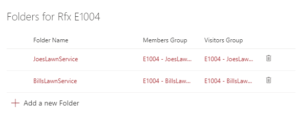
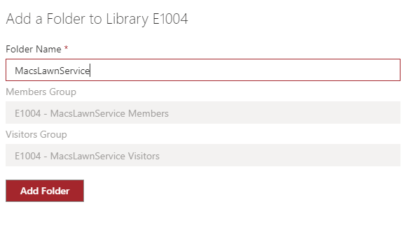

# Private Library/Folder Manager

## Summary

This sample provides a webpart that can be used to manage Document Libraries with Secured Subfolders. The use case this was developed for is a Request for Proposal site. A Document library is created for each RFP and subfolders are created within that Library for each external supplier invited to participate in that RFP.

The application manages all the security groups set up for the various libraries and folders so that suppliers only see RFP's they were invited to participate in and only thier folder in those libraries. General documents for the RFP that should be seen by everyone participating in the RFP can be put in the root folder of the library. General terms and conditions that everyone should see can be put at the root folder of the site.

## Compatibility

 

 

## Applies to

* [SharePoint Framework](https://docs.microsoft.com/sharepoint/dev/spfx/sharepoint-framework-overview)
* [Microsoft 365 tenant](https://docs.microsoft.com/sharepoint/dev/spfx/set-up-your-development-environment)

> Update accordingly as needed.
> DELETE THIS PARAGRAPH BEFORE SUBMITTING

## Solution

Solution|Author(s)
--------|---------
react Private Folder Manager | [Russell Gove](https://github.com/russgove) ([@russgove](https://twitter.com/russgove))

## Version history

Version|Date|Comments
-------|----|--------
1.0|July 2, 2021|Initial release

## Prerequisites

## Minimal Path to Awesome

Build  this solution and add it to your app catalog (tenant or site).

Create a new Team Site (Without and Office 365 Group) or Communications site. The site must be configured to allow sharing with any external parties you want to invite to the site.

Install this solution on the site

Create two Lists to hold the List of RFX's and the list of RFX Folders.
The lists must have the schemas below (using site content types is not needed.)

The RFX List:

(The title was renamed to RFX Number)

The RFX Folder List

(The RFx column is a lookup to the Title/RFX Number in the RFx list)

The scripts folder contains a site script (rfx.json) that can be used to create these lists.
The Powershell Script AddLists.ps1 in the same folder can be run to create a site design that creates these lists.

After creating the lists create a new site page and add the Request Maintenance webpart to it. (Break inheritance on the page and ensure only site members or owners have access to it!)

The webpart configuration is below:

The settings are :
* RFX List - the title of the RFX list created above. For each new RFX library created this list will contain the library Name, A closing date (just informational for now, but we could set up a workflow to break access on this date), a contract specialist (the person who create the library and owns it), and the ID's of the Libraries Owner, members and Visitors group (When a new library is added a separate Owners member and visitors group is created just for that library.)

* RFX Folders List - The title of the RFX Folders list created above. Whenever a new folder is added to a library using the webpart a new entry will be created in this list containing the RFX Name (a lookup to the RFX list), The FOlder Name, and the ID of the folder Members and Visitors groups (Whenever a new folder is created Members and visitors groups are created just for that folder.)

* Archive Library - The name of a standard document library that can be used to Archive RFX libraries after they are done. If no library name is entered, the Ardchive button will not be shown. When a library is Archived, it is moved to a subfolder in the Archive Library and ALL securiy groups associated with that RFX Library are deleted. 

* Permission for library members on Site - The Permission Library members group will be given on the overall Site (typically Read or View Only)

* Permission for library members on Libraries - The Permission the Library Members group will be given on that particular library  (Typically Contribute).

* Permission for library members on Folders - The Permission the Library Members group will be given on Folders within that particular library  (Typically Contribute).

* Permission for library visitors on Site - The Permission Library visitors group will be given on the overall Site (typically Read or View Only)

* Permission for library visitors on Libraries -  The Permission the Library Visitors group will be given on that particular library  (Typically Read or View Only).

* Permission for library visitors on Folders- The Permission the Library Visitors group will be given on Folders within that particular library  (Typically Read or View Only).

* Permission for Folder members on Site- The Permission Folder Members group will be given on the overall Site (typically Read or View Only)

* Permission for Folder members on Library -The Permission the Folder Members group will be given on the library containing the folder   (Typically Read or View Only).

* Permission for Folder members on Folders - The Permission the Folder Members group will be given on the folder   (Typically Contribute).

* Permission for Folder visitors on Site- The Permission Folder Visitors group will be given on the overall Site (typically Read or View Only)

* Permission for Folder visitors on Library - The Permission the Folder Visitors group will be given on the library containing the folder   (Typically Read or View Only).

* Permission for Folder visitors on Folders- The Permission the Folder Visitors group will be given on the  folder   (Typically Read or View Only).

* Allow users to change generated security group names - When Libraries and Folders are created group names are generated based on the Library and Folder name. If this switch is turned on users can override that name. Otherwise the name can not be changed.

* Private Folders - If this switch is turned OFF, the Manage Folders command will not be shown. Secured subfolders cannot be created. 

* App Insights instrumentation key- Optional App Insights instrumentation key to send telemetry to app insights if errors occur.

## Features

* Allows for creatiion of Libraries and folders with discrete configurable security groups.

* When libraries are deleted or archived using the app, all associated security groups are automatically deleted and users ins those groups no longer have access

* Can be used as an alternative to MS Teams for sharing data with external counterparties. All the data is in one site so its easier to manage. Additionl libraries and content can be created at the site level to be shared with all people who have access to the site.

* Security is easy to manage, just go to the webpart and find the Library or folder you want to gran access to and click on the appropriate group. You can see who has access and add / remove users in one spot.

* The Recent Actibity command can be used to see what activity has taken place recently within the givern library.

* Note that if this application is used, users must be warned that they should NEVER add or remove groups on the site. 

* As of July 2021 this app has been running in a production environment for 9 months with no reported issues.

## Disclaimer

**THIS CODE IS PROVIDED *AS IS* WITHOUT WARRANTY OF ANY KIND, EITHER EXPRESS OR IMPLIED, INCLUDING ANY IMPLIED WARRANTIES OF FITNESS FOR A PARTICULAR PURPOSE, MERCHANTABILITY, OR NON-INFRINGEMENT.**

## Help

We do not support samples, but we this community is always willing to help, and we want to improve these samples. We use GitHub to track issues, which makes it easy for  community members to volunteer their time and help resolve issues.

If you encounter any issues while using this sample, [create a new issue](https://github.com/pnp/sp-dev-fx-webparts/issues/new?assignees=&labels=Needs%3A+Triage+%3Amag%3A%2Ctype%3Abug-suspected&template=bug-report.yml&sample=YOUR-SOLUTION-NAME&authors=@YOURGITHUBUSERNAME&title=YOUR-SOLUTION-NAME%20-%20).

For questions regarding this sample, [create a new question](https://github.com/pnp/sp-dev-fx-webparts/issues/new?assignees=&labels=Needs%3A+Triage+%3Amag%3A%2Ctype%3Abug-suspected&template=question.yml&sample=YOUR-SOLUTION-NAME&authors=@YOURGITHUBUSERNAME&title=YOUR-SOLUTION-NAME%20-%20).

Finally, if you have an idea for improvement, [make a suggestion](https://github.com/pnp/sp-dev-fx-webparts/issues/new?assignees=&labels=Needs%3A+Triage+%3Amag%3A%2Ctype%3Abug-suspected&template=suggestion.yml&sample=YOUR-SOLUTION-NAME&authors=@YOURGITHUBUSERNAME&title=YOUR-SOLUTION-NAME%20-%20).

This package produces the following:

* lib/* - intermediate-stage commonjs build artifacts
* dist/* - the bundled script, along with other resources
* deploy/* - all resources which should be uploaded to a CDN.

### Build options

gulp clean - TODO
gulp test - TODO
gulp serve - TODO
gulp bundle - TODO
gulp package-solution - TODO
