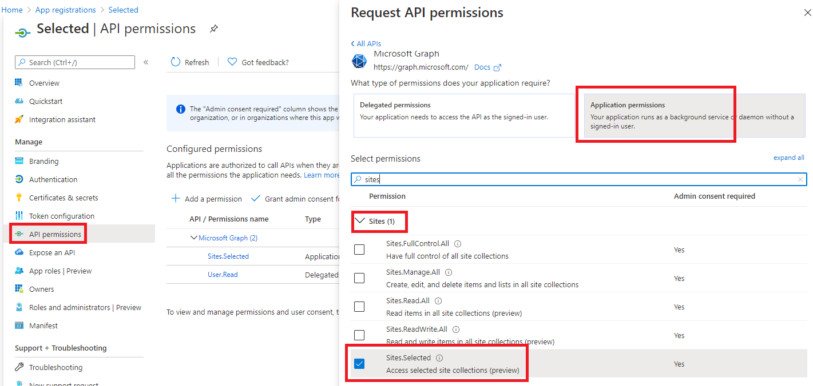
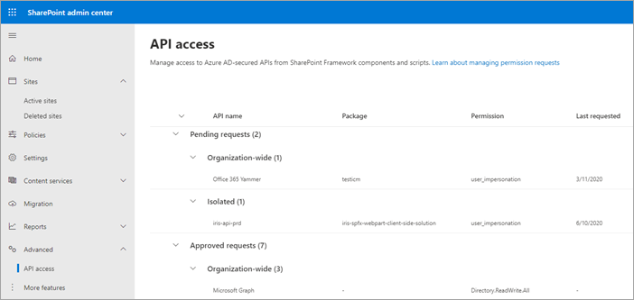
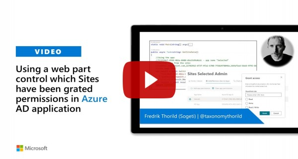

# Sites Selected Admin client-side web part

## Summary

This is a sample SharePoint Framework client-side web part built using react.

The web part lets you manage your Azure AD applications that have the Sites Selected Api permission. With this web part you'll get an UI for managing what app can connect to which site.

The web part uses the built in MSGraphClient and needs to be approved in API management. The app asks for Microsoft Graph `Application.Read.All` and `Sites.FullControl.All`. Users of the web part will need to have Site Collection Administrator privileges to the sites being added to an app.

## Web part usage

![alt text][web part in action]

[web part in action]: ./assets/sites-manager-demo.gif "Sites Selected Manager in action"

## Using the web part to grant an app access to a site, start to finish

![alt text][web part in action - Visual Studio]

[web part in action - Visual Studio]: ./assets/vsDemo.gif "Sites Selected Manager Demo"

## Compatibility

| :warning: Important          |
|:---------------------------|
| Every SPFx version is only compatible with specific version(s) of Node.js. In order to be able to build this sample, please ensure that the version of Node on your workstation matches one of the versions listed in this section. This sample will not work on a different version of Node.|
|Refer to <https://aka.ms/spfx-matrix> for more information on SPFx compatibility.   |

-Incompatible-red.svg "SharePoint Server 2016 Feature Pack 2 requires SPFx 1.1")

## Applies to

- [SharePoint Framework](https://aka.ms/spfx)
- [Microsoft 365 tenant](https://learn.microsoft.com/sharepoint/dev/spfx/set-up-your-developer-tenant)

> Get your own free development tenant by subscribing to [Microsoft 365 developer program](http://aka.ms/o365devprogram)

## Prerequisites

> One (or more) Azure AD app with Sites.Selected and the possibility to approve requests in API management (SharePoint Administrator). Site collection administrator is needed for the site(s) you want to give app access to.

## Solution

Solution|Author(s)
--------|---------
react-sites-selected-admin | Fredrik Thorild [@fthorild](https://twitter.com/fthorild)

## Version history

Version|Date|Comments
-------|----|--------
1.0|February 19, 2021|Initial release
1.1|March 8, 2021|Switch to functional components. Re-factor

## Minimal Path to Awesome

- Add an app in Azure AD, or for an existing app add the Sites.Selected Microsoft Graph api permission

>  This sample can also be opened with [VS Code Remote Development](https://code.visualstudio.com/docs/remote/remote-overview). Visit https://aka.ms/spfx-devcontainer for further instructions.

- Clone this repository
- Ensure that you are at the solution folder
- in the command-line run:
  - `gulp bundle --ship`
  - `gulp package-solution --ship`
- Add the `.sppkg` package to your app catalog
- Approve the api access requests

- Install web part on a site of your choice
- Add permissions to your app
- Try out the AAD app by sending a request using your favorite method  

## References

- [Getting started with SharePoint Framework](https://learn.microsoft.com/sharepoint/dev/spfx/set-up-your-developer-tenant)
- [Building for Microsoft teams](https://learn.microsoft.com/sharepoint/dev/spfx/build-for-teams-overview)
- [Use Microsoft Graph in your solution](https://learn.microsoft.com/sharepoint/dev/spfx/web-parts/get-started/using-microsoft-graph-apis)
- [Publish SharePoint Framework applications to the Marketplace](https://learn.microsoft.com/sharepoint/dev/spfx/publish-to-marketplace-overview)
- [Microsoft 365 Patterns and Practices](https://aka.ms/m365pnp) - Guidance, tooling, samples and open-source controls for your Microsoft 365 development

## Video

  
## Help

We do not support samples, but we this community is always willing to help, and we want to improve these samples. We use GitHub to track issues, which makes it easy for  community members to volunteer their time and help resolve issues.

If you're having issues building the solution, please run [spfx doctor](https://pnp.github.io/cli-microsoft365/cmd/spfx/spfx-doctor/) from within the solution folder to diagnose incompatibility issues with your environment.

You can try looking at [issues related to this sample](https://github.com/pnp/sp-dev-fx-webparts/issues?q=label%3A%22sample%3A%20react-content-query-online") to see if anybody else is having the same issues.

You can also try looking at [discussions related to this sample](https://github.com/pnp/sp-dev-fx-webparts/discussions?discussions_q=react-content-query-online) and see what the community is saying.

If you encounter any issues while using this sample, [create a new issue](https://github.com/pnp/sp-dev-fx-webparts/issues/new?assignees=&labels=Needs%3A+Triage+%3Amag%3A%2Ctype%3Abug-suspected%2Csample%3A%20react-content-query-online&template=bug-report.yml&sample=react-content-query-online&authors=@fthorild&title=react-content-query-online%20-%20).

For questions regarding this sample, [create a new question](https://github.com/pnp/sp-dev-fx-webparts/issues/new?assignees=&labels=Needs%3A+Triage+%3Amag%3A%2Ctype%3Aquestion%2Csample%3A%20react-content-query-online&template=question.yml&sample=react-content-query-online&authors=@fthorild&title=react-content-query-online%20-%20).

Finally, if you have an idea for improvement, [make a suggestion](https://github.com/pnp/sp-dev-fx-webparts/issues/new?assignees=&labels=Needs%3A+Triage+%3Amag%3A%2Ctype%3Aenhancement%2Csample%3A%20react-content-query-online&template=question.yml&sample=react-content-query-online&authors=@fthorild&title=react-content-query-online%20-%20).

## Disclaimer

**THIS CODE IS PROVIDED *AS IS* WITHOUT WARRANTY OF ANY KIND, EITHER EXPRESS OR IMPLIED, INCLUDING ANY IMPLIED WARRANTIES OF FITNESS FOR A PARTICULAR PURPOSE, MERCHANTABILITY, OR NON-INFRINGEMENT.**

