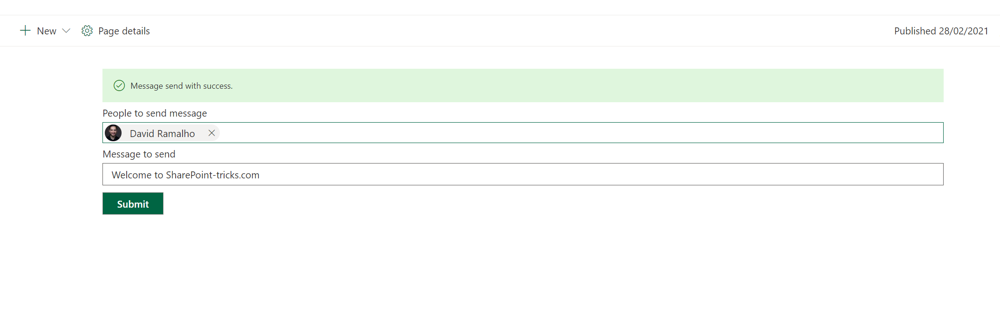

# Message Teams User

## Summary

Sample that shows how to send a message to Microsoft Teams using a SharePoint framework solution using Microsoft Graph.

.

## Compatibility

| :warning: Important          |
|:---------------------------|
| Every SPFx version is only compatible with specific version(s) of Node.js. In order to be able to build this sample, please ensure that the version of Node on your workstation matches one of the versions listed in this section. This sample will not work on a different version of Node.|
|Refer to <https://aka.ms/spfx-matrix> for more information on SPFx compatibility.   |


-Incompatible-red.svg "SharePoint Server 2016 Feature Pack 2 requires SPFx 1.1")


## Applies to

* [SharePoint Framework](https://learn.microsoft.com/sharepoint/dev/spfx/sharepoint-framework-overview)
* [Office 365 tenant](https://learn.microsoft.com/sharepoint/dev/spfx/set-up-your-developer-tenant)


## Prerequisites

* SharePoint Online tenant
* You have provided permission in SharePoint admin for accessing Graph API on behalf of your solution. We can do it before deployment as proactive steps, or after deployment. You can refer to [steps about how to do this post-deployment](https://learn.microsoft.com/sharepoint/dev/spfx/use-aad-tutorial#deploy-the-solution-and-grant-permissions). Basically you have to use API Access Page of SharePoint admin and add below permission for our use case.

```json
 "webApiPermissionRequests": [
  {
    "resource": "Microsoft Graph",
    "scope": "ChatMessage.Send"
  },
  {
    "resource": "Microsoft Graph",
    "scope": "Chat.Create"
  },
  {
    "resource": "Microsoft Graph",
    "scope": "Chat.ReadWrite" 
  },
  {
    "resource": "Microsoft Graph",
    "scope": "User.Read"
  },
  {
    "resource": "Microsoft Graph",
    "scope": "User.ReadWrite.All"
  },
  {
    "resource": "Microsoft Graph",
    "scope": "Directory.Read.All"
  },
  {
    "resource": "Microsoft Graph",
    "scope": "Directory.ReadWrite.All"
  }
]

```

## Concepts

This Web Part illustrates the following concepts on top of the SharePoint Framework:

* Using react framework in SPFx web part
* Calling Microsoft Graph API in SPFx web part

## Solution

Solution|Author(s)
--------|---------
teams-messages| [David Ramalho](https://github.com/DRamalho92) ([@davRamalho](https://twitter.com/davRamalho))


## Version history

Version|Date|Comments
-------|----|--------
1.0|February 28, 2021|Initial release


## Minimal Path to Awesome

- Clone this repository
- in the command line run:
  - `npm install`
  - `gulp serve`

>  This sample can also be opened with [VS Code Remote Development](https://code.visualstudio.com/docs/remote/remote-overview). Visit https://aka.ms/spfx-devcontainer for further instructions.


## Help

We do not support samples, but we this community is always willing to help, and we want to improve these samples. We use GitHub to track issues, which makes it easy for  community members to volunteer their time and help resolve issues.

If you're having issues building the solution, please run [spfx doctor](https://pnp.github.io/cli-microsoft365/cmd/spfx/spfx-doctor/) from within the solution folder to diagnose incompatibility issues with your environment.

If you encounter any issues while using this sample, [create a new issue](https://github.com/pnp/sp-dev-fx-webparts/issues/new?assignees=&labels=Needs%3A+Triage+%3Amag%3A%2Ctype%3Abug-suspected%2Csample%3A%20react-teams-message-user&template=bug-report.yml&sample=react-teams-message-user&authors=@DRamalho92&title=react-teams-message-user%20-%20).

For questions regarding this sample, [create a new question](https://github.com/pnp/sp-dev-fx-webparts/issues/new?assignees=&labels=Needs%3A+Triage+%3Amag%3A%2Ctype%3Aquestion%2Csample%3A%20react-teams-message-user&template=question.yml&sample=react-teams-message-user&authors=@DRamalho92&title=react-teams-message-user%20-%20).

Finally, if you have an idea for improvement, [make a suggestion](https://github.com/pnp/sp-dev-fx-webparts/issues/new?assignees=&labels=Needs%3A+Triage+%3Amag%3A%2Ctype%3Aenhancement%2Csample%3A%20react-teams-message-user&template=question.yml&sample=react-teams-message-user&authors=@DRamalho92&title=react-teams-message-user%20-%20).

## Disclaimer

**THIS CODE IS PROVIDED *AS IS* WITHOUT WARRANTY OF ANY KIND, EITHER EXPRESS OR IMPLIED, INCLUDING ANY IMPLIED WARRANTIES OF FITNESS FOR A PARTICULAR PURPOSE, MERCHANTABILITY, OR NON-INFRINGEMENT.**


